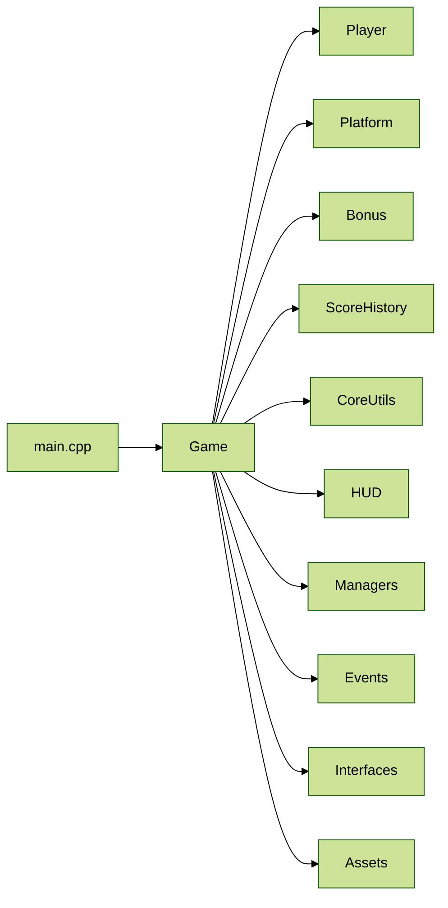

# Updown Journey Project


An independent 2D game currently in development for the Sega Dreamcast, following the journey of a human character traveling from top to bottom. 


## Status


## Testing

The project includes a comprehensive unit test suite using Google Test framework:

- **20 unit tests** covering Scene system functionality
- **3 test categories**: Core functionality, serialization, coordinate conversion
- **Automated testing** with CTest integration
- **Test data** files for realistic testing scenarios

```bash
# Build and run all tests
cd build && make updown_journey_tests && ./tests/updown_journey_tests

# Run tests using CTest
cd build && ctest --verbose

# Run specific test suite
cd build && ./tests/updown_journey_tests --gtest_filter="SceneTest.*"
```

See [`tests/README.md`](tests/README.md) for detailed testing documentation.


## Project Structure Diagram



## Known issues

##### Ninja generator issue
- kos toolchain seems to have issues with ninja (`floating-point exception`)
- This issue is oddly not visible in certain circumstances ( e.g when building and calling just after a custom target)
    - Didn't find the root cause, but as a workaround, we can use the `Unix Makefiles` generator instead of `Ninja` in the CMake configuration.

In `settings.json`:
```json
{
    "cmake.generator": "Unix Makefiles"
}
```