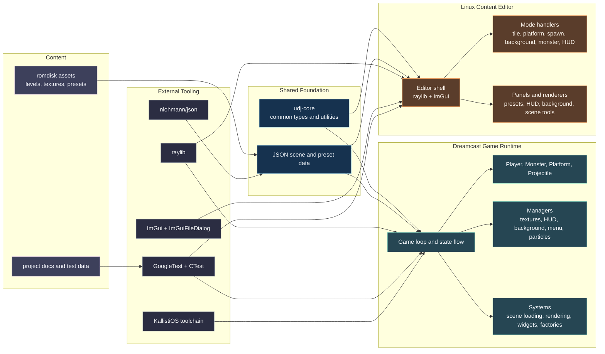

# UpDown Journey


UpDown Journey is a C++20 2D game project targeting the Sega Dreamcast, with a Linux desktop editor for building and testing content. The repository is split into a shared core library, the Dreamcast game runtime, and an ImGui-based level editor that reuses the same data model where possible.

## Status


The codebase currently supports two main workflows:

- Dreamcast runtime development and hardware debugging
- Linux editor development for level, HUD, background, and preset authoring

## Highlights

- Shared `udj-core` library used by both the game and editor targets
- Dreamcast runtime with scene loading, platform behavior strategies, HUD, particles, and actor factories
- Desktop editor built with raylib + ImGui for content authoring
- GoogleTest-based automated tests with CTest integration
- Dreamcast-focused debug workflow using `dc-tool-ip` and `sh-elf-gdb`

## Global Architecture


```mermaid
flowchart LR
    classDef core fill:#16324f,stroke:#8ecae6,color:#f8fbff,stroke-width:1px;
    classDef runtime fill:#264653,stroke:#84dcc6,color:#f8fbff,stroke-width:1px;
    classDef editor fill:#5a3d2b,stroke:#f4a261,color:#fff8f0,stroke-width:1px;
    classDef data fill:#3d405b,stroke:#cdb4db,color:#f8f9ff,stroke-width:1px;
    classDef ext fill:#2b2d42,stroke:#adb5bd,color:#f8f9fa,stroke-width:1px;

    subgraph Shared[Shared Foundation]
        Core[udj-core\ncommon types and utilities]
        SceneData[JSON scene and preset data]
    end

    subgraph Runtime[Dreamcast Game Runtime]
        Game[Game loop and state flow]
        Gameplay[Player, Monster, Platform, Projectile]
        RuntimeManagers[Managers\ntextures, HUD, background, menu, particles]
        RuntimeSystems[Systems\nscene loading, rendering, widgets, factories]
    end

    subgraph Editor[Linux Content Editor]
        EditorApp[Editor shell\nraylib + ImGui]
        ModeHandlers[Mode handlers\ntile, platform, spawn, background, monster, HUD]
        EditorPanels[Panels and renderers\npresets, HUD, background, scene tools]
    end

    subgraph Assets[Content]
        Romdisk[romdisk assets\nlevels, textures, presets]
        Docs[project docs and test data]
    end

    subgraph Tooling[External Tooling]
        Raylib[raylib]
        ImGui[ImGui + ImGuiFileDialog]
        JSON[nlohmann/json]
        GTest[GoogleTest + CTest]
        KOS[KallistiOS toolchain]
    end

    Core --> Game
    Core --> EditorApp
    SceneData --> Game
    SceneData --> EditorApp

    Game --> Gameplay
    Game --> RuntimeManagers
    Game --> RuntimeSystems

    EditorApp --> ModeHandlers
    EditorApp --> EditorPanels

    Romdisk --> SceneData
    Docs --> GTest

    Raylib --> Game
    Raylib --> EditorApp
    ImGui --> EditorApp
    JSON --> SceneData
    GTest --> Game
    GTest --> EditorApp
    KOS --> Game

    class Core,SceneData core;
    class Game,Gameplay,RuntimeManagers,RuntimeSystems runtime;
    class EditorApp,ModeHandlers,EditorPanels editor;
    class Romdisk,Docs data;
    class Raylib,ImGui,JSON,GTest,KOS ext;
```

## Repository Layout

```text
.
├── src/
│   ├── udj-core/           Shared library used by game and editor
│   ├── udjourney/          Dreamcast game runtime
│   └── udjourney-editor/   Linux editor and editor-specific tests
├── tests/                  Runtime-focused unit tests
├── docs/                   Feature and platform documentation
├── toolchains/             Dreamcast CMake toolchain files
├── build-linux.sh          Convenience build for the Linux editor
└── build-dreamcast-debug.sh  Convenience build for Dreamcast debug builds
```

## Build Workflows

### Linux Editor

The fastest way to build the editor on Linux is the provided script:

```bash
./build-linux.sh
cd build/editor-linux
./udjourney_editor
```

Prerequisites:

- `cmake`
- `ninja`
- `gcc-12` and `g++-12`
- desktop `raylib`

### Top-Level CMake Build

Use the root project when you want the shared library, runtime tests, and non-Dreamcast targets in a single build tree:

```bash
cmake -S . -B build -G Ninja \
  -DCMAKE_BUILD_TYPE=Debug \
  -DCMAKE_C_COMPILER=gcc-12 \
  -DCMAKE_CXX_COMPILER=g++-12

cmake --build build
ctest --test-dir build --output-on-failure
```

### Dreamcast Debug Build

Set up the KallistiOS environment first, then use the debug build script:

```bash
source /opt/toolchains/dc/kos/environ.sh
./build-dreamcast-debug.sh
```

That produces the Dreamcast ELF in `build-dreamcast-debug/src/udjourney/` and is intended for deployment and remote debugging.

## Testing

There are two main test surfaces in the repo.

### Runtime Tests

The root `tests/` directory exercises core runtime behavior such as scene loading, serialization, coordinate conversion, and platform reuse behavior.

```bash
cmake --build build --target updown_journey_tests
./build/tests/updown_journey_tests
ctest --test-dir build --output-on-failure
```

### Editor Tests

The editor build defines dedicated editor test executables, including `udjourney_editor_tests` and `editorpanel_tests`.

```bash
cd build/editor-linux
ctest --output-on-failure
```

For more detail on the runtime test layout, see [tests/README.md](tests/README.md).

## Documentation Index

- [docs/DREAMCAST_DEBUGGING.md](docs/DREAMCAST_DEBUGGING.md) explains the Dreamcast debugging workflow with GDB.
- [docs/dreamcast-connectivity.md](docs/dreamcast-connectivity.md) covers device connectivity and network troubleshooting.
- [docs/BACKGROUND_SYSTEM.md](docs/BACKGROUND_SYSTEM.md) documents the background layer authoring system.
- [docs/PARTICLE_SYSTEM.md](docs/PARTICLE_SYSTEM.md) describes particle presets and runtime behavior.
- [docs/WIDGET_SYSTEM.md](docs/WIDGET_SYSTEM.md) covers widgets, menu actions, and scrolling backgrounds.
- [tests/README.md](tests/README.md) describes the runtime unit test structure.

## Editor Scope

The Linux editor currently focuses on content authoring rather than game simulation. Based on the current source layout, it includes:

- level creation strategies and scene import flows
- tile, platform, spawn, monster, background, and HUD editing modes
- preset managers for animation, particle, monster, platform, HUD, and UI atlas data
- background layer authoring and HUD rendering previews

## Known Issue

### Dreamcast + Ninja

The Dreamcast toolchain can hit a `floating-point exception` when used with the Ninja generator in some configurations. If that affects your local setup, switch the generator to `Unix Makefiles` for Dreamcast builds.

```json
{
  "cmake.generator": "Unix Makefiles"
}
```
