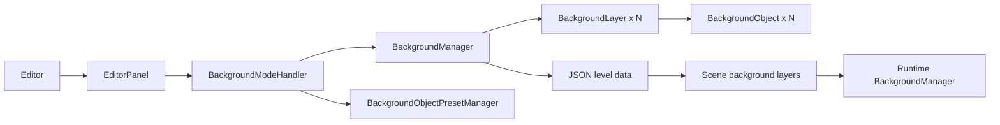

# Background Layer System

## Overview
The background layer system allows the editor to support parallax scrolling backgrounds with up to 5 independent layers, each containing multiple objects. This creates depth and visual interest in game levels.

## Architecture Overview



The editor-side background tooling owns authoring, selection, and JSON persistence. The runtime-side background manager then consumes the serialized scene data and handles drawing plus UI scrolling behavior in-game.

## Architecture

### Components

#### 1. BackgroundObject (`BackgroundLayer.hpp`)
A simple struct representing an object placed in a background layer:
- `sprite_name`: Name/path of the sprite texture
- `x`, `y`: World position coordinates
- `scale`: Size multiplier (1.0 = original size)
- `rotation`: Rotation angle in degrees

#### 2. BackgroundLayer (`BackgroundLayer.hpp`, `BackgroundLayer.cpp`)
Represents a single parallax layer:
- **name**: Human-readable layer name (e.g., "Sky", "Mountains")
- **texture_file**: Optional background texture that tiles across the layer
- **parallax_factor**: Controls parallax speed (0.0 = static, 1.0 = moves with foreground)
- **depth**: Rendering order (lower = rendered first/behind)
- **objects**: Vector of BackgroundObjects placed in this layer

**Key Methods:**
- `add_object(obj)`: Add an object to the layer
- `remove_object(index)`: Remove object by index
- `clear_objects()`: Remove all objects
- Getters/setters for all properties

#### 3. BackgroundManager (`BackgroundManager.hpp`, `BackgroundManager.cpp`)
Central manager for all background layers:
- Enforces MAX_LAYERS = 5 constraint
- Maintains layer list sorted by depth
- Handles layer selection state
- Provides JSON persistence

**Key Methods:**
- `add_layer(layer)`: Add new layer (returns false if at max)
- `remove_layer(index)`: Remove layer by index
- `move_layer_up(index)` / `move_layer_down(index)`: Reorder layers
- `add_object(layer_idx, obj)`: Add object to specific layer
- `remove_object(layer_idx, obj_idx)`: Remove object from layer
- `select_layer(index)`: Select layer for editing
- `load_from_file(filename)` / `save_to_file(filename)`: JSON persistence

#### 4. BackgroundModeHandler (`BackgroundModeHandler.hpp`, `BackgroundModeHandler.cpp`)
Editor strategy responsible for background edit mode:
- Renders background-specific controls inside the main editor UI
- Coordinates layer selection, creation, deletion, and object placement
- Uses `BackgroundObjectPresetManager` for placeable object presets
- Exposes placement state back to the editor scene

**Key Methods:**
- `render()`: Main UI entry point for background editing
- `render_layer_list()`: Shows all layers with selection and ordering controls
- `render_layer_properties()`: Edits the currently selected layer
- `render_object_controls()`: Configures object placement and presets
- `render_delete_confirmation()`: Guards destructive layer deletion

#### 5. EditorPanel (`EditorPanel.hpp`, `EditorPanel.cpp`)
Top-level ImGui shell that hosts edit modes, including background editing:
- Owns the current editor mode
- Delegates background-specific UI to `BackgroundModeHandler`
- Shares state with `Editor` and `EditorScene`

## Integration

### In Editor Class
The background system is integrated into the editor through the shared editor shell rather than a dedicated standalone panel:

1. **Editor state** keeps the data model and preset manager:
   ```cpp
   BackgroundManager background_manager;
  BackgroundObjectPresetManager background_object_preset_manager;
   ```

2. **EditorPanel wiring** connects the UI layer to both managers:
  - `EditorPanel::set_background_managers(...)`
  - background edit mode is handled by `BackgroundModeHandler`

3. **EditorScene placement flow** uses the handler state to place selected background objects into the selected layer.

## JSON Format

Background data is saved/loaded using this JSON structure:

```json
{
  "layers": [
    {
      "name": "Sky",
      "texture_file": "sky.png",
      "parallax_factor": 0.3,
      "depth": 0,
      "objects": [
        {
          "sprite_name": "cloud1",
          "x": 100.0,
          "y": 50.0,
          "scale": 1.0,
          "rotation": 0.0
        }
      ]
    },
    {
      "name": "Mountains",
      "texture_file": "mountains.png",
      "parallax_factor": 0.6,
      "depth": 1,
      "objects": [
        {
          "sprite_name": "tree",
          "x": 200.0,
          "y": 300.0,
          "scale": 1.2,
          "rotation": 10.0
        }
      ]
    }
  ]
}
```

## Usage Workflow

1. **Adding a Layer:**
   - Click "Add Layer" button
   - Enter layer name
   - Set texture file (optional, for tiled background)
   - Adjust parallax factor (0.0-1.0)
   - Set depth for rendering order

2. **Editing a Layer:**
   - Select layer from list
   - Modify properties in the properties panel
   - Use up/down arrows to reorder layers

3. **Adding Objects to Layer:**
   - Select layer
   - Enter sprite name/path
   - Set position, scale, and rotation
   - Click "Add Object"

4. **Removing Elements:**
   - Layers: Select layer and click "Remove Layer"
   - Objects: Click "Remove" button next to object in list

5. **Persistence:**
  - Background configuration is serialized with the level JSON
  - The runtime scene loader reads the same layer/object structure

## Parallax Factor Guide

- **0.0**: Static (background doesn't move, e.g., distant sky)
- **0.1-0.3**: Far background (clouds, distant mountains)
- **0.4-0.6**: Mid-ground (hills, buildings)
- **0.7-0.9**: Near background (close trees, foreground objects)
- **1.0**: Moves exactly with camera (same as foreground)

## Depth Ordering

Layers are automatically sorted by depth before rendering:
- **Lower depth** = Rendered first = Appears behind
- **Higher depth** = Rendered last = Appears in front

Example:
- Depth 0: Sky
- Depth 1: Distant mountains
- Depth 2: Hills
- Depth 3: Close trees
- Depth 4: Foreground decorations

## Runtime Relationship

At runtime, the gameplay target does not reuse the editor classes directly. Instead:

- editor background data is written into scene JSON
- `udjourney::scene::Scene` parses `BackgroundLayerData`
- the runtime `udjourney::BackgroundManager` binds to the scene and renders sorted layers
- UI screens can additionally use the runtime manager's scroll state for menu backgrounds

## Testing

The system includes dedicated unit coverage in `test_background.cpp`:
- BackgroundLayer construction and object management
- BackgroundManager layer management and constraints
- Layer selection and movement
- Object management per layer
- JSON serialization/deserialization
- Depth-based sorting

All 12 tests pass as part of the `udjourney_editor_tests` suite.

## Future Enhancements

Potential improvements:
1. Visual preview of background in EditorScene
2. Drag-and-drop object placement
3. Layer visibility toggles
4. Background animation support
5. Texture browser/picker
6. Copy/paste layers and objects
7. Background templates/presets
8. Real-time parallax preview with camera movement
