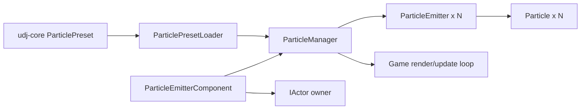

# Particle System Documentation

The particle system provides a flexible way to create visual effects like explosions, trails, smoke, and sparkles in the game.

## udj-core split

Some particle-related types are shared with tooling (the editor), so they are also provided by **udj-core**:

- **Shared data types** (usable by game + editor): `udjourney::ParticlePreset`
- **Runtime implementation** (game-only for now): `Particle`, `ParticleEmitter`, `ParticleManager`, `ParticleEmitterComponent`, `ParticlePresetLoader`

This allows the editor to depend on **udj-core** without depending on the **udjourney** game target.

## Architecture



The system is split between shared configuration data and runtime-only simulation. Presets are loaded once, emitters are created by name, and per-frame update/draw work stays inside `ParticleManager`.

The particle system follows the existing game architecture patterns:

### Core Components

1. **Particle** ([src/udjourney/include/udjourney/particle/Particle.hpp](src/udjourney/include/udjourney/particle/Particle.hpp))
   - Individual particle with position, velocity, lifetime, color, and size
   - Automatically interpolates between start and end values over its lifetime

2. **ParticleEmitter** ([src/udjourney/include/udjourney/particle/ParticleEmitter.hpp](src/udjourney/include/udjourney/particle/ParticleEmitter.hpp))
   - Spawns and manages particles based on a preset
   - Supports continuous emission or burst mode
   - Position can be updated each frame

3. **ParticlePreset**
    - Shared type available in both places:
      - Game include path: [src/udjourney/include/udjourney/particle/ParticlePreset.hpp](src/udjourney/include/udjourney/particle/ParticlePreset.hpp)
      - Core include path (for editor + shared code): [src/udj-core/include/udjourney/particle/ParticlePreset.hpp](src/udj-core/include/udjourney/particle/ParticlePreset.hpp)
   - Configuration for particle effect (velocities, colors, lifetime, etc.)
    - Supports full-texture rendering and optional atlas rendering

4. **ParticleManager** ([src/udjourney/include/udjourney/managers/ParticleManager.hpp](src/udjourney/include/udjourney/managers/ParticleManager.hpp))
   - Manages all active emitters
   - Handles rendering and cleanup
   - Accessible via `Game::get_particle_manager()`

5. **ParticleEmitterComponent** ([src/udjourney/include/udjourney/components/ParticleEmitterComponent.hpp](src/udjourney/include/udjourney/components/ParticleEmitterComponent.hpp))
   - Attaches particle emitters to actors
   - Automatically syncs emitter position with actor
   - Implements IComponent interface

6. **ParticlePresetLoader** ([src/udjourney/include/udjourney/loaders/ParticlePresetLoader.hpp](src/udjourney/include/udjourney/loaders/ParticlePresetLoader.hpp))
   - Loads particle presets from JSON files

## File Structure

```
src/udj-core/
├── include/udjourney/
│   └── particle/
│       └── ParticlePreset.hpp   # Shared preset type (editor-safe)

src/udjourney/
├── include/udjourney/
│   ├── particle/
│   │   ├── Particle.hpp
│   │   ├── ParticleEmitter.hpp
│   │   └── ParticlePreset.hpp   # Game-side copy (kept for compatibility)
│   ├── managers/
│   │   └── ParticleManager.hpp
│   ├── components/
│   │   └── ParticleEmitterComponent.hpp
│   └── loaders/
│       └── ParticlePresetLoader.hpp
└── src/
    ├── particle/
    │   ├── Particle.cpp
    │   └── ParticleEmitter.cpp
    ├── managers/
    │   └── ParticleManager.cpp
    ├── components/
    │   └── ParticleEmitterComponent.cpp
    └── loaders/
        └── ParticlePresetLoader.cpp

romdisk/
└── particles.json    # Particle effect presets
```

## Usage Examples

### 1. Load Particle Presets

```cpp
#include "udjourney/managers/ParticleManager.hpp"

ParticleManager& particle_manager = game.get_particle_manager();
if (particle_manager.load_presets("particles.json")) {
    // Presets are now available by name
}
```

### 2. Create a One-Shot Burst Effect

```cpp
ParticleManager& particle_manager = game.get_particle_manager();

Vector2 explosion_pos = {100.0f, 200.0f};
particle_manager.create_burst("explosion", explosion_pos);
```

### 3. Create a Continuous Effect

```cpp
ParticleManager& particle_manager = game.get_particle_manager();

Vector2 position = {150.0f, 300.0f};
ParticleEmitter* emitter = particle_manager.create_emitter("trail", position);

if (emitter) {
    emitter->set_position(new_position);
}
```

### 4. Attach Particles to an Actor

```cpp
#include "udjourney/components/ParticleEmitterComponent.hpp"

auto component = std::make_unique<ParticleEmitterComponent>(
    game.get_particle_manager(),
    "sparkle",
    Vector2{0.0f, -10.0f}
);

actor->add_component(std::move(component));
```

### 5. Manual Burst from Component

```cpp
// Get the component
auto* particle_component = actor->get_component<ParticleEmitterComponent>();

if (particle_component) {
    // Trigger burst effect (e.g., on damage or special action)
    particle_component->emit_burst();
}
```

## Preset Configuration

Particle effects are defined in [romdisk/particles.json](src/udjourney/romdisk/particles.json):

```json
{
  "particles": [
    {
      "name": "explosion",
      "texture_file": "",
      "use_atlas": false,
      "source_rect": {"x": 0, "y": 0, "width": 8, "height": 8},
      "emission_rate": 0,
      "burst_count": 30,
      "particle_lifetime": 0.8,
      "lifetime_variance": 0.3,
      "velocity_min": {"x": -150.0, "y": -150.0},
      "velocity_max": {"x": 150.0, "y": -50.0},
      "acceleration": {"x": 0.0, "y": 300.0},
      "start_color": [255, 200, 50, 255],
      "end_color": [100, 50, 0, 0],
      "start_size": 8.0,
      "end_size": 2.0,
      "rotation_speed": 180.0,
      "emitter_lifetime": 0.0
    }
  ]
}
```

### Preset Parameters

- **name**: Unique identifier for the preset
- **texture_file**: Path to texture (empty string = draw basic form)
- **use_atlas**: If true, uses `source_rect` as an atlas region; if false, renders the full texture
- **source_rect**: Rectangle in texture to use when `use_atlas` is true
- **emission_rate**: Particles per second (0 = burst mode only)
- **burst_count**: Number of particles in burst (0 = continuous only)
- **particle_lifetime**: How long each particle lives (seconds)
- **lifetime_variance**: Random variance in lifetime
- **velocity_min/max**: Random velocity range for spawned particles
- **acceleration**: Applied to all particles (for gravity-like effects)
- **start_color/end_color**: RGBA color interpolated over lifetime
- **start_size/end_size**: Size interpolated over lifetime
- **rotation_speed**: Rotation per second (degrees)
- **emitter_lifetime**: Auto-destroy emitter after time (0 = infinite)

## Built-in Effects

The system includes 5 preset effects in [particles.json](src/udjourney/romdisk/particles.json):

1. **explosion**: Burst of orange/red particles with gravity
2. **trail**: Continuous white fading trail
3. **impact**: Blue burst effect for collisions
4. **sparkle**: Golden continuous sparkles floating upward
5. **smoke**: Large gray particles rising slowly

## Performance Considerations

- Uses simple `std::vector` allocation (no object pooling)
- Particles render in single depth layer
- Alpha blending only (no additive blending yet)
- Dead particles cleaned up automatically
- Empty emitters removed automatically

## Integration Points

The particle system is integrated into the game at these points:

1. **Game.hpp/cpp**: `ParticleManager` is owned by `Game`
2. **Game::update()**: updates all emitters each frame
3. **Game::draw_particles()**: delegates particle rendering through the manager
4. **Actor components**: `ParticleEmitterComponent` attaches effects to moving actors
5. **Preset loading**: presets are resolved by name through `ParticleManager`

## Future Enhancements

Potential improvements:
- More particle shapes when no texture is set (rectangle/triangle/star, etc.)
- Additive blend mode for fire/magic effects
- Per-emitter depth control
- Object pooling for better performance
- Collision/interaction with game world
