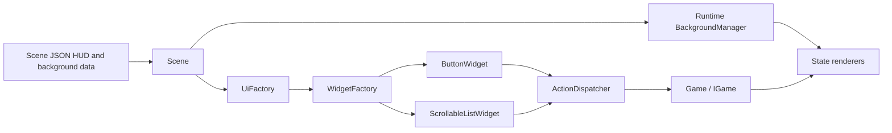

# Widget System & Scrolling Backgrounds

## Overview

The game now supports:
1. **Interactive widgets** (buttons, future: sliders, checkboxes) for menus
2. **Scrolling backgrounds** for infinite vertical scrolling effects  
3. **Action dispatcher** for menu actions and scene transitions

## Runtime Architecture



The menu/UI flow is data-driven: scene JSON defines HUD elements, the runtime creates widget instances from those definitions, and user interaction resolves to named actions routed back into the game.

## Components

### 1. ActionDispatcher
Handles menu actions defined in JSON with callbacks.

**Usage:**
```cpp
// Register an action
ActionDispatcher::register_action("start_game", [](IGame* game, const auto& params) {
    game->load_scene("level1.json");
});

// Execute from widget
ActionDispatcher::execute("start_game", game);
```

**Predefined Actions:**
- `start_game` - Starts the game from level 1
- `load_level:level_name` - Loads a specific level (e.g., "load_level:level2")
- `show_options` - Shows options menu (TODO)
- `quit_game` - Closes the game
- `return_to_title` - Returns to title screen

### 2. Widgets

The runtime currently instantiates widgets through `WidgetFactory` based on the `type_id` stored in scene HUD data.

#### ButtonWidget
Interactive button for menus.

**JSON Configuration:**
```json
{
  "name": "Start Button",
  "type_id": "menu_button",
  "anchor": "MiddleCenter",
  "offset": {"x": 0, "y": 0},
  "size": {"x": 200, "y": 50},
  "properties": {
    "text": "START GAME",
    "button_action": "start_game",
    "font_size": "24",
    "border_thickness": "2"
  }
}
```

**Properties:**
- `text` - Button text
- `button_action` - Action to execute on click
- `font_size` - Text size (default: 24)
- `border_thickness` - Border width (default: 2)
- `normal_color` - Default text color
- `hover_color` - Text color when hovered
- `click_color` - Text color when clicked

### 3. Scrolling Backgrounds

Add limitless scrolling backgrounds to any scene.

**JSON Configuration:**
```json
{
  "backgrounds": {
    "layers": [
      {
        "name": "Scrolling Stars",
        "texture_file": "backgrounds/stars.png",
        "depth": 0,
        "parallax_factor": 1.0,
        "auto_scroll_enabled": true,
        "scroll_speed_x": 0,
        "scroll_speed_y": -30,
        "repeat": true,
        "objects": []
      }
    ]
  }
}
```

**Properties:**
- `auto_scroll_enabled` - Enable auto-scrolling (default: false)
- `scroll_speed_x` - Horizontal scroll speed in pixels/second
- `scroll_speed_y` - Vertical scroll speed in pixels/second
- `repeat` - Repeat layer content for looping backgrounds
- `parallax_factor` - Parallax effect (0.0 = follows camera, 1.0 = static)
- `depth` - Layer ordering (lower = behind)

## Creating a Title Screen

### Step 1: Create title_screen.json

```json
{
  "name": "Title Screen",
  "backgrounds": {
    "layers": [
      {
        "name": "Background",
        "texture_file": "backgrounds/stars.png",
        "auto_scroll_enabled": true,
        "scroll_speed_x": 0,
        "scroll_speed_y": -40,
        "repeat": true
      }
    ]
  },
  "fuds": [
    {
      "type_id": "menu_button",
      "name": "Start",
      "anchor": "MiddleCenter",
      "offset": {"x": 0, "y": 0},
      "size": {"x": 200, "y": 50},
      "properties": {
        "text": "START GAME",
        "button_action": "start_game"
      }
    }
  ]
}
```

### Step 2: Load Title Screen

```cpp
// Use the public scene loading flow
load_and_apply_scene("levels/title_screen.json");
```

`load_and_apply_scene(...)` keeps the scene load and runtime object creation path together, including HUD/widget creation.

### Step 3: Add Background Images

Create seamless tileable textures:
- Place in `romdisk/backgrounds/`
- For vertical scrolling, texture height should tile seamlessly
- Recommended sizes: 640x480 or multiples

## Editor Integration

Scrolling background authoring in the desktop editor is documented in more detail in [BACKGROUND_SYSTEM.md](BACKGROUND_SYSTEM.md).

### Adding Widgets in Editor

Widgets are added as FUD elements:

1. Open FUD mode in editor
2. Add new FUD
3. Set `type_id` to `menu_button`
4. Configure properties:
   - `text`: Button text
   - `button_action`: Action string
   - `font_size`: Text size
5. Position using anchor and offset

### Adding Scrolling Backgrounds

1. Open Background mode in editor
2. Add background layer
3. Set texture file
4. Enable scrolling:
   - Check `auto_scroll_enabled`
  - Set `scroll_speed_x` and `scroll_speed_y`
  - Set `repeat` for seamless looping

## Advanced Usage

### Custom Actions

Register custom actions in `Game::register_menu_actions()`:

```cpp
ActionDispatcher::register_action("custom_action", [](IGame* game, const auto& params) {
    // Custom behavior
    std::cout << "Custom action triggered!" << std::endl;
});
```

### Multi-Layer Scrolling

Create parallax scrolling with multiple layers at different speeds:

```json
{
  "layers": [
    {"scroll_speed_y": -20, "depth": 0},
    {"scroll_speed_y": -40, "depth": 1},
    {"scroll_speed_y": -60, "depth": 2}
  ]
}
```

### Supported Widget Types

Based on the current runtime factory, these widget type IDs are recognized:

- `menu_button`
- `icon_button`
- `small_button`
- `large_button`
- `textured_button`
- `scrollable_list`

### Widget Hierarchies

Future feature - widgets can contain child widgets for complex UIs.

## Future Enhancements

- [ ] SliderWidget for volume/settings
- [ ] CheckboxWidget for options
- [ ] TextInputWidget for naming
- [ ] Animation support for widgets
- [ ] Widget focus navigation (keyboard/gamepad)
- [ ] Widget state persistence
