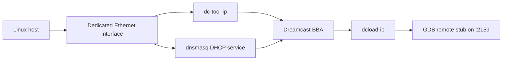

# Dreamcast Connectivity

## Running the game on hardware (BBA connection)

We assume the IP address of the Dreamcast is `10.42.0.80`.
The Dreamcast is connected to the network via a BBA (Broadband Adapter) through the Ethernet port of the host machine.

## Network Topology



This setup has two distinct channels:

- DHCP from `dnsmasq`, which assigns the Dreamcast an address
- deployment/debug traffic from `dc-tool-ip` and optionally GDB

```shell
make run-dc
```

## DHCP Setup with `dnsmasq`

To allow your Dreamcast to get an IP address automatically over Ethernet (via BBA), you’ll need to set up a lightweight DHCP server using `dnsmasq`.

#### 1. Install `dnsmasq`

```bash
sudo apt install dnsmasq
```

#### 2. Configure `dnsmasq`

Create a configuration file specifically for the Dreamcast setup:

```bash
sudo nano /etc/dnsmasq.d/dreamcast.conf
```

Add the following content:

```ini
interface=<your-dreamcast-interface>
bind-interfaces

dhcp-range=192.168.0.50,192.168.0.150,12h
dhcp-option=3,192.168.0.1
dhcp-option=6,8.8.8.8,1.1.1.1
```

Replace `<your-dreamcast-interface>` with the name of your Ethernet-to-USB adapter or relevant NIC (for example `enxa0cec85e02d8`).
You can find it using:

```bash
ip addr
```

Look for the interface that is **connected to the Dreamcast** (usually shows as `DOWN` when unplugged, `UP` when plugged in).

#### 3. Restart `dnsmasq`

```bash
sudo systemctl restart dnsmasq
```

#### 4. Find the Dreamcast IP

While your Dreamcast is booted into `dcload-ip` (or a network-enabled app/game):

```bash
sudo journalctl -u dnsmasq -f
```

Look for a block like:

```text
DHCPDISCOVER(enx...) ...
DHCPOFFER(enx...) 192.168.0.85 ...
DHCPREQUEST ...
DHCPACK ...
```

The IP address offered (e.g., `192.168.0.85`) is the one you’ll use with tools like `dc-tool-ip`.

### Connection Troubleshooting

This section provides some common issues and their solutions when setting up the network connection between your Dreamcast and your host machine.

#### Check the journal for dnsmasq

It provides useful information about the DHCP process and any potential issues.
```bash
sudo journalctl -u dnsmasq -f
```

#### Issue : dnsmasq.service failed to start
If you see an error like this:

```text
Apr 22 22:55:33 daoliangshu-ux430uq dnsmasq[36544]: unknown interface <you-interface>
Apr 22 22:55:33 daoliangshu-ux430uq dnsmasq[36544]: FAILED to start up
```
It means that the interface is not available when dnsmasq starts.

##### The interface is not up
It can mean that the interface is not up.
Check with:
```bash
ip addr show <your-dreamcast-interface>
```
Example output:
```text
$ ip addr show enxa0cec85e02d8
17: enxa0cec85e02d8: <BROADCAST,MULTICAST> mtu 1500 qdisc noop state DOWN group default qlen 1000
    link/ether a0:ce:c8:5e:02:d8 brd ff:ff:ff:ff:ff:ff
```
Here we see the interface exists, but is down.
In that case, you can bring it up with:
```bash
sudo ip link set enxa0cec85e02d8 up
```
Then restart dnsmasq:
```bash
sudo systemctl restart dnsmasq
```

##### The interface does not exist

Check if the interface name is correct in `/etc/dnsmasq.d/dreamcast.conf` (or whatever name you used for the configuration file).
Check if your device is connected to the Dreamcast and your laptop.

#### Issue : dcload-ip is not receiving an IP address

If your Dreamcast isn’t being assigned an IP address, you can check what's going wrong by inspecting the system journal:

```bash
sudo journalctl -u dnsmasq -f
```

If you see a message like this:

```text
DHCP packet received on <your-dreamcast-interface> which has no address
```
It means that your Dreamcast is sending a DHCP request, but your network adapter (usually the USB-Ethernet interface) doesn’t have an IP address assigned to it — so dnsmasq can’t respond.

To fix this, assign a static IP address to the adapter:

```bash
sudo ip addr add 192.168.0.1/24 dev <your-dreamcast-interface>
sudo ip link set <your-dreamcast-interface> up
```

Then restart `dnsmasq`:
```bash
sudo systemctl restart dnsmasq
```

Finally, verify that the IP address has been correctly assigned:
```bash
ip addr show <your-dreamcast-interface>
```

##### Summary of useful commands for debugging the connection to dc-tool-ip

1. Read the logs
```bash
sudo journalctl -u dnsmasq -f
```
2. Try to bring up the interface, assign an IP address
```bash
sudo ip link set enxa0cec85e02d8 up
sudo ip addr flush dev enxa0cec85e02d8
sudo ip addr add 192.168.0.1/24 dev enxa0cec85e02d8 # replace with your interface
```
3. Restart `dnsmasq`:
```bash
sudo systemctl restart dnsmasq
```

4. If this problem persists, you can use a `udev` rule to automatically assign an IP address to the interface when it is connected.
Create a file in `/etc/udev/rules.d/` with the following content:

```bash
sudo nano /etc/udev/rules.d/99-ethernet-static.rules
```

Inside put:

```bash
ACTION=="add", SUBSYSTEM=="net", ATTR{address}=="a0:ce:c8:5e:02:d8", NAME="enxa0cec85e02d8", RUN+="/sbin/ip addr flush dev enxa0cec85e02d8", RUN+="/sbin/ip addr add 192.168.0.1/24 dev enxa0cec85e02d8", RUN+="/sbin/ip link set enxa0cec85e02d8 up"
```

Replace `a0:ce:c8:5e:02:d8` with the MAC address of your interface. You can find it using:

```bash
ip link show <your-dreamcast-interface>
```

Then reload `udev` rules and trigger them:

```bash
sudo udevadm control --reload-rules
sudo udevadm trigger
```

## Connectivity Checklist

- the host NIC is up and has `192.168.0.1/24`
- `dnsmasq` is bound to that NIC
- the Dreamcast is booted into `dcload-ip`
- `journalctl -u dnsmasq -f` shows DHCP discovery and ACK traffic
- `dc-tool-ip -t <dreamcast-ip> ...` can reach the assigned address

## Debugging CMake and Deployment Commands

```bash
source /opt/toolchains/dc/kos/environ.sh
cmake -S . -B build/build-test -DCMAKE_TOOLCHAIN_FILE=toolchains/dreamcast.cmake -DCMAKE_BUILD_TYPE=Debug
cmake --build build/build-test/  -- -j 4

export CMAKE_CXX_COMPILER_LAUNCHER=gdb
cmake --build build/build-test/ --config Debug --target all --verbose
```
```bash
cmake --build build --target updown-journey -- -j 4
```
```bash
cmake --build build --target updown-journey -- -j 4 -- VERBOSE=1
```
